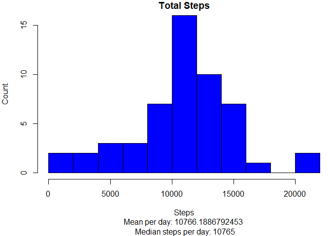
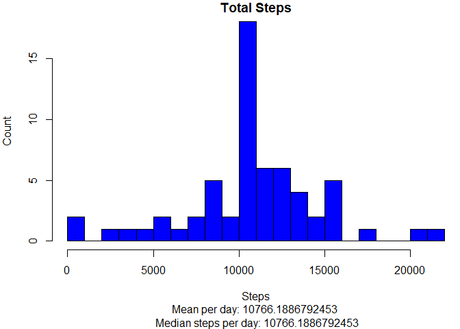
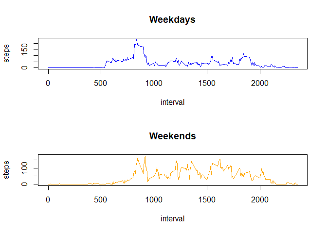

We have 5 tasks or questions to answer in this assignment:

1. Loading and preprocessing the data
2. What is mean total number of steps taken per day?
3. What is the average daily activity pattern?
4. Imputing missing values
5. Are there differences in activity patterns between weekdays and weekends?

## Data file information

The variables included in this dataset are:

steps: Number of steps taking in a 5-minute interval (missing values are coded as \color{red}{\verb|NA|}NA)
date: The date on which the measurement was taken in YYYY-MM-DD format
interval: Identifier for the 5-minute interval in which measurement was taken
The dataset is stored in a comma-separated-value (CSV) file and there are a total of 17,568 observations in this dataset.


## Loading and preprocessing the data

```r
library(dplyr)
```

```
## 
## Attaching package: 'dplyr'
```

```
## The following objects are masked from 'package:stats':
## 
##     filter, lag
```

```
## The following objects are masked from 'package:base':
## 
##     intersect, setdiff, setequal, union
```

```r
# set constants
## set verbosity of processing the script
verbose <- TRUE 

## file constants
dfile <- "destfile.zip"
folder <- "RepData_PeerAssessment1"
CSVfile <- "activity.csv"


########## Check for the file
if(verbose) print("Checking for file....")
```

```
## [1] "Checking for file...."
```

```r
if(!file.exists(dfile))
{
  url <- "https://d396qusza40orc.cloudfront.net/repdata%2Fdata%2Factivity.zip"
  download.file(url,dfile)
  
}

######## Check for the unzipped folder
if(verbose) print("Checking for unzipped folder....")
```

```
## [1] "Checking for unzipped folder...."
```

```r
if(!file.exists(folder)) 
{
  unzip(dfile, overwrite = TRUE)
}
if(verbose) print("Folder unzipped....")
```

```
## [1] "Folder unzipped...."
```

```r
if(verbose) print("Reading the data....")
```

```
## [1] "Reading the data...."
```

```r
dset <- read.csv(CSVfile)
if(verbose) print("data loaded....")
```

```
## [1] "data loaded...."
```

```r
dset$date <- as.Date(dset$date)
```

## What is mean total number of steps taken per day?
 Aggregate the total steps and determine mean and median

```r
totalSteps <- aggregate(steps ~ date, dset, sum)
meanSteps <- mean(totalSteps$steps)
medianSteps <- median(totalSteps$steps)
```

## What is the average daily activity pattern?

 1. Use a histogram to to compare Steps
 2. Put the mean and median value on the bottom

```r
par(mar=c(6,4,1,0))
hist(totalSteps$steps,main = "Total Steps", xlab = "Steps",ylab = "Count", col="blue", breaks = 15)

mtext(paste("Mean per day:",meanSteps,"\n","Median steps per day:",medianSteps), 1, 5)
```

<!-- -->


## Imputing missing values
 1. Aggregate the steps of each interval to a mean if the step is not NA
 2. Fill a new dataset
 3. Display a histogram

```r
if(verbose) print("sum and aggregate....")
```

```
## [1] "sum and aggregate...."
```

```r
adap <- aggregate(steps~interval, data=dset, mean, na.rm=TRUE)

if(verbose) print("fill in missing data....")
```

```
## [1] "fill in missing data...."
```

```r
fset = dset
cond = is.na(dset[, 'steps']) 
from = "steps"
fset[cond, "steps"] = adap[match(fset[cond, "interval"], adap[, 'interval']), from]
totalSteps <- aggregate(steps ~ date, fset, sum)
if(verbose) print("Plot the data....")
```

```
## [1] "Plot the data...."
```

```r
par(mar=c(6,4,1,0))
hist(totalSteps$steps,main = "Total Steps", xlab = "Steps",ylab = "Count", col="blue", breaks = 20)
mtext(paste("Mean per day:",mean(totalSteps$steps),"\n","Median steps per day:",median(totalSteps$steps)), 1, 5)
```

<!-- -->

Is there an issue if, after assigning the missing values the average of the interval, the median steps per day equal the mean steps per day?

## Are there differences in activity patterns between weekdays and weekends?
 1. Set the day of the week by creating a new column
 2. Determine if it's a weekday or a weekend (funday!!) and create a new column.
 3. Plot the the graphs for both weekday and weekend in a panel plot

```r
dset$dayOfWeek <- weekdays(dset$date)
weekend <- c("Saturday", "Sunday")
dset$dayType <- as.factor(ifelse(dset$dayOfWeek %in% weekend, "weekend", "weekday"))

workdays <- dset[dset$dayType == "weekday",]
playdays <- dset[dset$dayType == "weekend",]

awdap <- aggregate(steps~interval, data=workdays, mean, na.rm=TRUE)
apdap <- aggregate(steps~interval, data=playdays, mean, na.rm=TRUE)

par(mfrow = c(2, 1))
plot(awdap, type = "l", col = "blue", main = "Weekdays")
plot(apdap, type = "l", col = "orange", main = "Weekends")
```

<!-- -->

It is clear the activity pattern on the weekend is more than the weekday. It also appears on the weekdays most activity is in the morning (the rush to work or to walk the dog?). Is this accidental or a numeric or computational anomaly? Would determination of causation explain any anomalies? 
